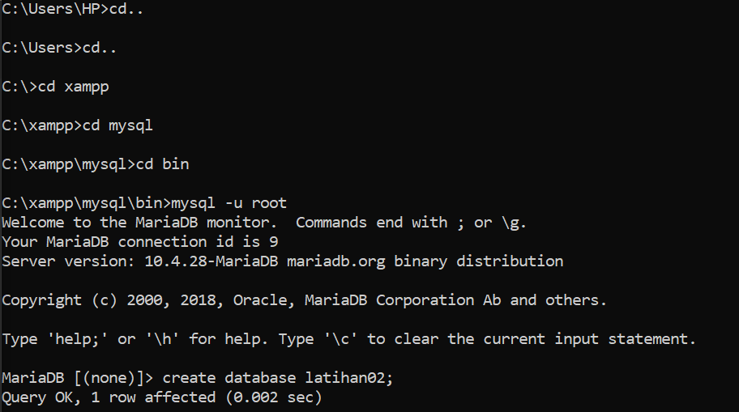
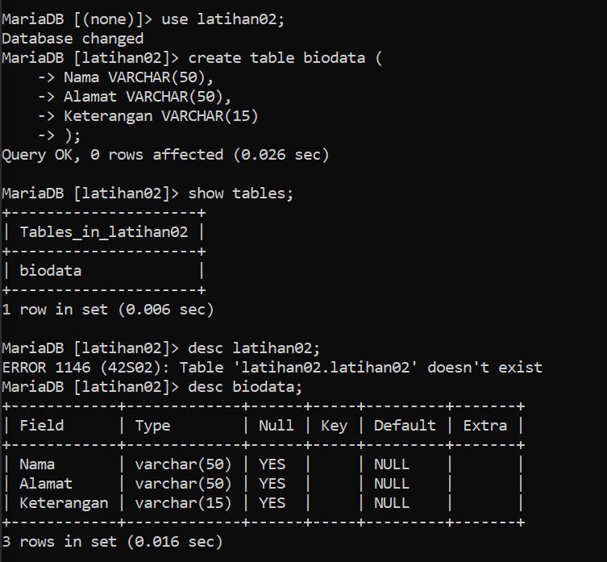
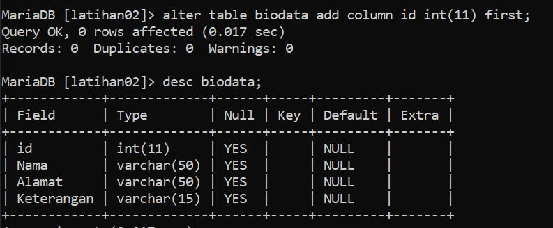
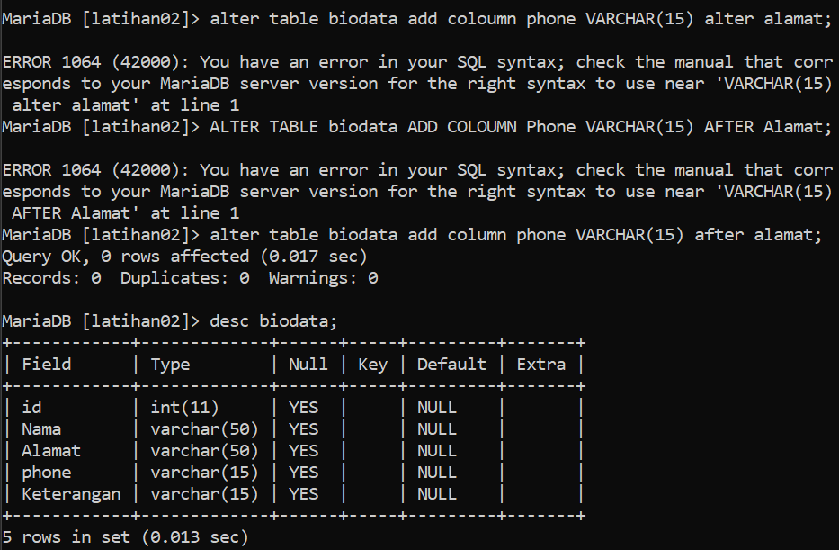
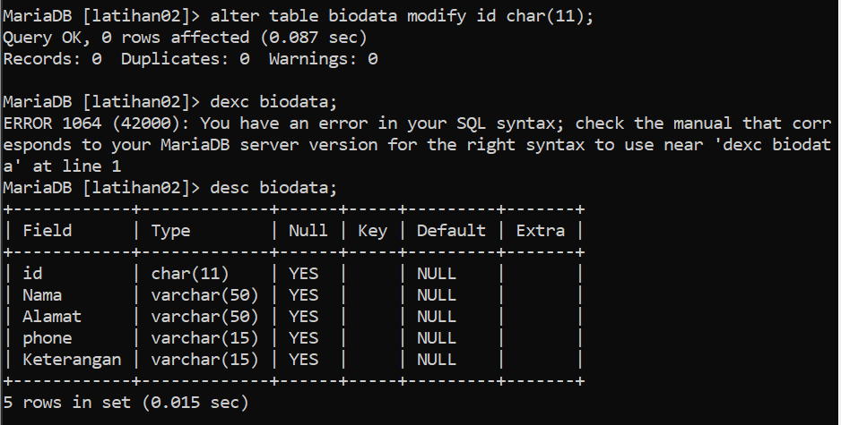
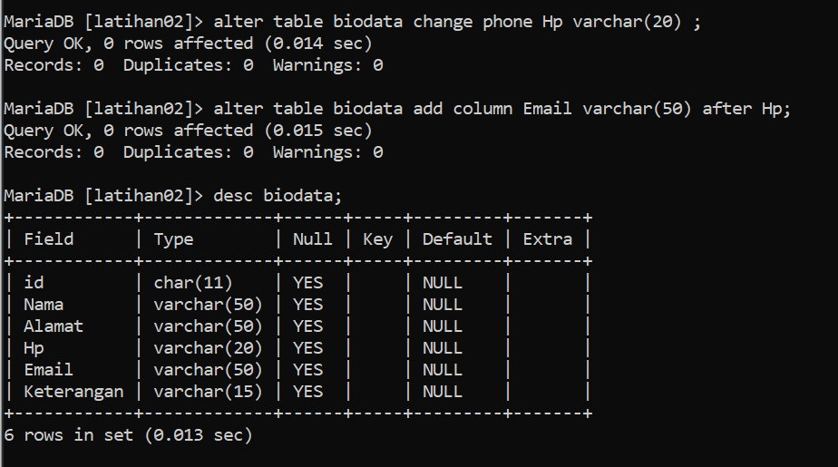
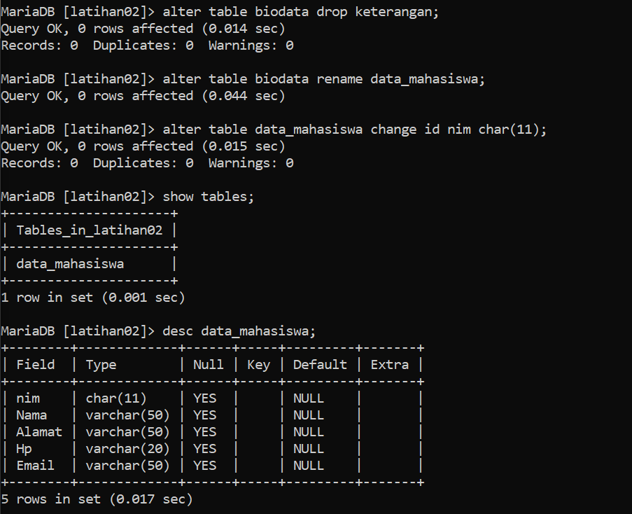
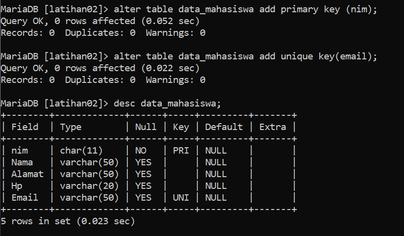

# Latihan02-Mysql

## Latihan membuat Database menggunakan Mysql
## Tugas Praktikum
1. Membuat sebuah databasse dengan nama latihan02!

## Penjelasan :
Menggunakan perintah **Create Database Nama_Database;** untuk membuat database baru

2. Membuat sebuah tabel dengan nama biodata (nama, alamat) didalam database latihan1!
3. Tambahkan sebuah kolom keterangan Varchar(15) sebagai kolom akhir!

## Penjelasan :
* Use latihan02; untuk menggunakan database yang sudah dibuat diawal.
* Create Table; untuk membuat sebuah tabel.
* Show table; untuk menampilkan sebuah tabel yang sudah dibuat didalam database.
* Desc biodata; untuk melihat tabel yang bernama biodata.

4. Tambahkan kolom id int (11) diawal sebagai kolom pertama!

## Penjelasan :
* Alter table biodata add column id int(11) first; untuk menambah field id dengan integer maksimal 11 angka diatas kolom nama.

5. Sisipkan sebuah kolom dengan nama phone Varchar(15) setelah kolom alamat!

## Penjelasan :
* Alter Table biodata add column phone Varchar(15) after alamat; untuk menambahkan field phone dengann Varchar(15) setelah kolom alamat.

6. Ubah tipe data kolom id menjadi Char(11)!

## Penjelasan  :
* Alter Table biodata modify id Char(11); yaitu mengubah type data id dari int menjadi char.

7. Ubah nama kolom phone menjadi hp Varchar(20)

8. Tambahkan kolom email setelah kolom hp!

## Penjelasan :
* Alter Table biodata change phone hp Varchar (20); ubah field phone menjadi hp
* Alter Table biodata add column email Varchar (50) after hp; add kolom atau field email dibawah hp.

9. Hapus kolom keterangan dari tabel
10. Ganti nama tabel menjadi data_mahasiswa!
11. Ganti nama field id menjadi nim!

## Penjelasan :
* Alter Table biodata drop keterangan ; untuk menghapus field keterangan dari tabel biodata.
* Alter Table biodata Rename data_mahasiswa; untuk mengganti nama tabel biodata menjadi data_mahasiswa
* Alter Table data_mahasiswa Change id nim char(11); untuk mengubah kolom/field id menjadi nim dengan char(11)

12. jadikan nim sebagai Primary Key
13. Jadikan kolom Email sebagai Unique Key

## Penjelasan :
* Alter Table data_mahasiswa add primary key (nim); untuk menjadikan nim sebagai primary key
* Alter Table data_mahasiswa add unique key (email); untuk menjadikakn email sebagai unique key

